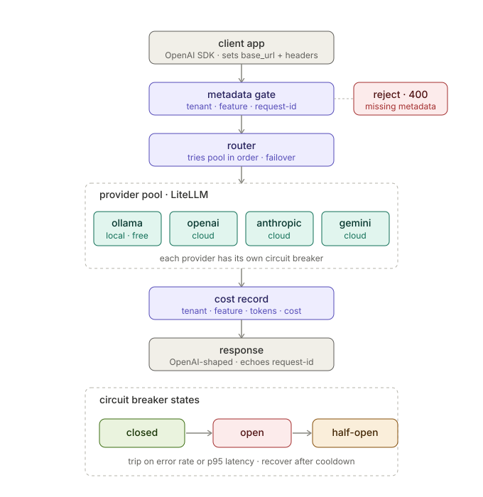

# Self-Healing LLM Gateway

**An OpenAI-compatible gateway that spreads your LLM calls across multiple providers and automatically reroutes around any that fail or slow down — so your app keeps working when a provider doesn't.**



## What it does

- **Drop-in OpenAI-compatible** — point your OpenAI client's `base_url` at it; no other code changes.
- **Automatic failover** across OpenAI, Anthropic, Gemini, and a local Ollama model, normalized with LiteLLM.
- **Self-healing** — a per-provider circuit breaker detects failures or slowness and brings a provider back on its own once it recovers.
- **Cost attribution** — every call is tagged to a tenant / feature with an estimated cost.
- **Survives outages** — non-urgent ("deferrable") requests are queued and retried in the background instead of failing.

Runs fully locally with **no API keys** (uses a local Ollama model if available, mock responses otherwise).

## Roadmap

- **Phase 1 (done): Route every model call through one service.** A FastAPI
  service that speaks the OpenAI `/v1/chat/completions` request/response shape,
  so existing OpenAI clients adopt it by changing only their `base_url`.
- **Phase 2 (done): Self-healing resilience.** LiteLLM normalizes vendor
  differences; a pool of providers (a local Ollama model plus OpenAI, Anthropic,
  Gemini) fails over automatically. Each provider has a circuit breaker
  (closed / open / half-open) that trips on error rate or p95 latency and
  recovers on its own via half-open probes; failover follows per-request-class
  preference lists; and latency-sensitive classes can hedge. Full write-up in
  [docs/phase-2.md](docs/phase-2.md).
- **Phase 3 (in progress): Queue & retry deferrable work.** Requests are
  classified at the API boundary as interactive (fail fast) or deferrable
  (queued and retried in the background so they survive an outage). See
  [docs/phase-3.md](docs/phase-3.md).
- Phase 4: Prometheus metrics + Grafana dashboard.

## Documentation

- **[docs/guide.md](docs/guide.md) — start here.** A plain-language walkthrough
  of the whole gateway: what it is, why each piece exists, and exactly what
  happens to a request. Read this to understand the project.
- [docs/architecture.md](docs/architecture.md) — the terse reference: request
  lifecycle, each module, and the full API reference.
- **[docs/phase-2.md](docs/phase-2.md)** — the complete Phase 2 write-up in one
  place: the circuit breaker, half-open probes, per-request-class failover, and
  hedged requests (with the cost trade-off), plus config and tests.
- **[docs/phase-3.md](docs/phase-3.md)** — Phase 3 (in progress): interactive vs
  deferrable requests, and how deferrable work is queued and retried to survive
  an outage.

## Run it

```bash
pip install -r requirements.txt
python -m uvicorn app.main:app --port 8000 --reload
```

Then open http://localhost:8000/docs

It runs with **no API keys**: it uses a local Ollama model if one is running,
and falls back to mock responses otherwise — so failover works out of the box.

## Use it from an existing OpenAI client

Point the client at the gateway; change nothing else.

Every request must carry attribution metadata as headers — set them once via
`default_headers` and change nothing else:

```python
from openai import OpenAI

client = OpenAI(
    base_url="http://localhost:8000/v1",
    api_key="not-needed-for-mock",
    default_headers={"X-Tenant-Id": "acme", "X-Feature": "search"},
)

resp = client.chat.completions.create(
    model="gpt-4",
    messages=[{"role": "user", "content": "Hello!"}],
)
print(resp.choices[0].message.content)
```

Required headers: `X-Tenant-Id` and `X-Feature` (a request without them is
rejected with 400). `X-Request-Id` is optional — it's generated if absent and
always returned in the response's `X-Request-Id` header. Each call emits a
usage record tying tenant + feature to tokens and estimated cost.

## Use real providers

Copy `.env.example` to `.env` and add a key for any provider you want to run live
(`OPENAI_API_KEY`, `ANTHROPIC_API_KEY`, `GEMINI_API_KEY`). Providers without a key
run in mock mode, so the gateway always starts and failover always has somewhere
to go. A local Ollama model needs no key — just a running Ollama server.

## Endpoints

| Method | Path                    | Purpose                              |
|--------|-------------------------|--------------------------------------|
| POST   | `/v1/chat/completions`  | OpenAI-compatible chat endpoint      |
| GET    | `/v1/jobs/{job_id}`     | Status of a queued deferrable request|
| GET    | `/v1/models`            | Minimal model list                   |
| GET    | `/health`               | Provider pool + circuit state        |
| GET    | `/`                     | Service info                         |
| GET    | `/docs`                 | Interactive API docs                 |
